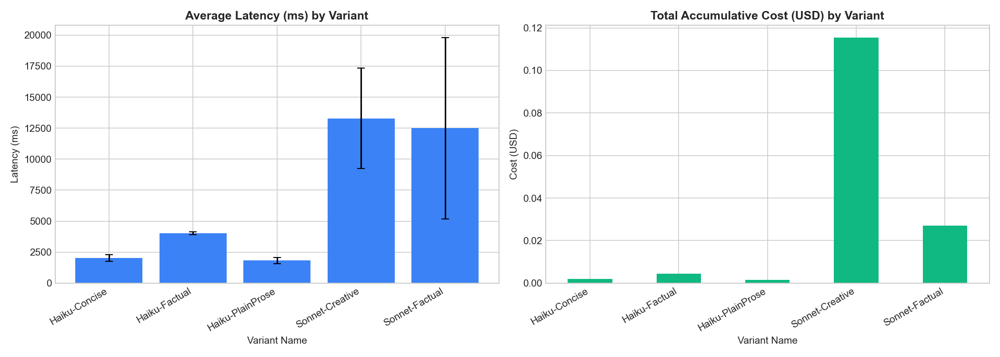

# Prompt Testing & Experimentation Harness

## The Iterative Feedback Loop

Prompt engineering in production requires moving away from manual ad-hoc testing toward a systematic, data-driven cycle:

```text
+------------------+     +------------------+     +------------------+     +------------------+
|    Hypothesis    | --> |    Experiment    | --> |       Log        | --> |     Analyze      |
|  Define prompt   |     | Run variants in  |     | Log latency, cost|     | Run stats and    |
| system guidelines|     | parallel gather  |     |  tokens, truncs  |     | standard dev/err |
+------------------+     +------------------+     +------------------+     +------------------+
```

1. **Hypothesis:** Formulate a testable assumption. E.g., *"We hypothesize that Claude 3.5 Sonnet with a high temperature (temp=0.7) and a creative system prompt will produce higher clarity/accuracy scores at the cost of 5x higher latency and 4x higher cost-per-token compared to Claude 3.5 Haiku with a low temperature (temp=0.2) and a plain prose system prompt."*
2. **Experiment:** Define the variations inside YAML configurations (`prompts/concept_explanations.yaml`) and execute them concurrently using the execution harness (`experiments/prompt_testing/harness.py`). The harness uses an asynchronous semaphore (concurrency limit = 5) to batch and dispatch requests concurrently.
3. **Log:** The harness captures metadata and telemetry for every request and writes them asynchronously to the central SQLite database `data/prompt_experiments.db` in the following schema:
   - `variant_name`, `model`, `temperature`, `system_prompt`, `max_tokens`
   - `latency_ms` (exact HTTP request roundtrip duration)
   - `cost_usd` (accumulated client-side cost tracking)
   - `input_tokens`, `output_tokens`
   - `stop_reason` (captures whether the API naturally completed with `end_turn` or hit the token limit with `max_tokens`)
   - `truncated` (boolean flag detecting truncation)
4. **Analyze:** Open the Jupyter analysis notebook ([experiments/analysis.ipynb](file:///Users/vamsi_cheruku/Desktop/Agentic%20AI%20Journey/experiments/analysis.ipynb)) to pull logs into a pandas DataFrame using the `get_results()` helper. Aggregating by variant name allows us to evaluate average latency stability (with standard deviation error bars) and cost efficiency (average cost per 1,000 output tokens) to select the best production prompt.

---

## Practical Example: Explaining Quantum Entanglement

In our Week 2 experiments, we ran a direct comparison between multiple variants to explain "Quantum Entanglement" to a "10-Year-Old". The results from the SQLite run logs illustrate the trade-offs:

### 1. Haiku-PlainProse (Claude 3.5 Haiku)
- **Prompt Style:** Concise prose, no markdown, max 200 tokens, temperature=0.2.
- **Latency:** `1.83s` average (standard deviation: `±0.25s`). Highly stable and predictable.
- **Cost per 1k Output Tokens:** `$0.0043`. Extremely cheap.
- **Output:** Quick, literal analogies (e.g., "Imagine two magic coins that are best friends...").

### 2. Sonnet-Creative (Claude 3.5 Sonnet)
- **Prompt Style:** Metaphor-rich, imaginative storytelling, max 4000 tokens, temperature=0.7.
- **Latency:** `13.29s` average (standard deviation: `±4.04s`). Latency is volatile; some runs took up to `16.1s`.
- **Cost per 1k Output Tokens:** `$0.0153` (3.5x higher cost rate).
- **Output:** Extremely detailed, engaging formatting with markdown and emoticons.

### Visualization Output
Below is the generated latency and cost distribution visualization from [experiments/analysis.ipynb](file:///Users/vamsi_cheruku/Desktop/Agentic%20AI%20Journey/experiments/analysis.ipynb), reflecting the standard deviation error bars:



---

## How to Run the Experiments

### 1. Configure the Harness
Set the provider in `harness.py`:
```python
PROVIDER = LLMProvider.CLAUDE  # or LLMProvider.OPENAI
CONCURRENCY = 5                # Adjust rate-limit throttle
```

### 2. Execute the Harness
Ensure your environment variables are configured and run the client:
```bash
python experiments/prompt_testing/harness.py
```
This initializes the database, generates a unique `run_id`, batches tasks using a Semaphore, runs the variant matrix in parallel, and logs results directly to `data/prompt_experiments.db`.

### 3. Analyze the Results
Start the Jupyter server or open [experiments/analysis.ipynb](file:///Users/vamsi_cheruku/Desktop/Agentic%20AI%20Journey/experiments/analysis.ipynb) in your editor. Run the notebook cells to view the tabular comparison and render the latency error-bar graphs.
